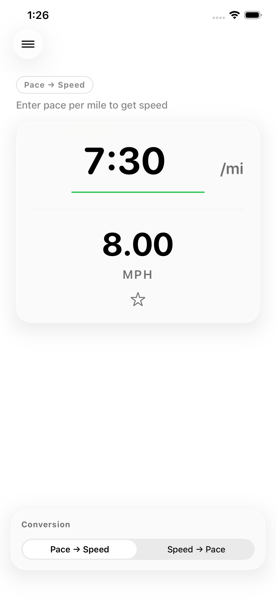
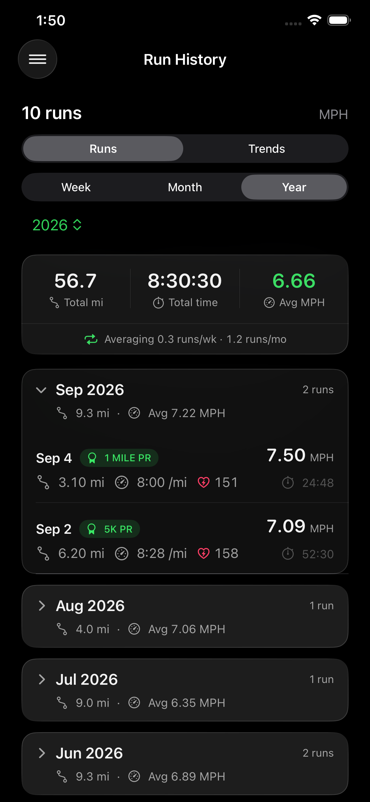
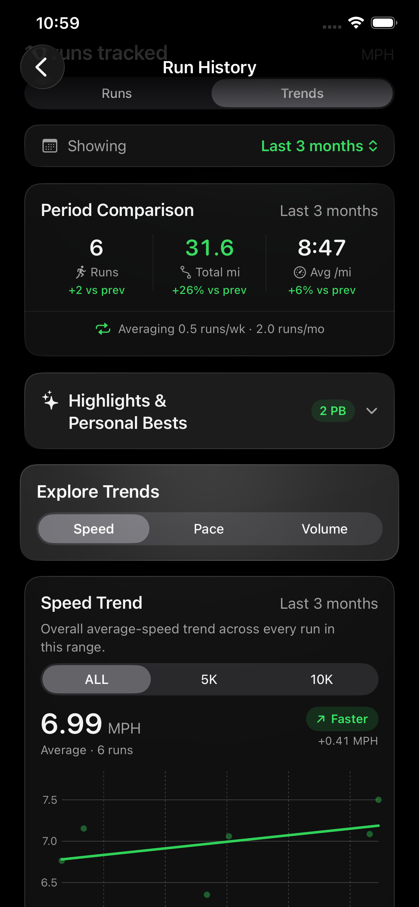
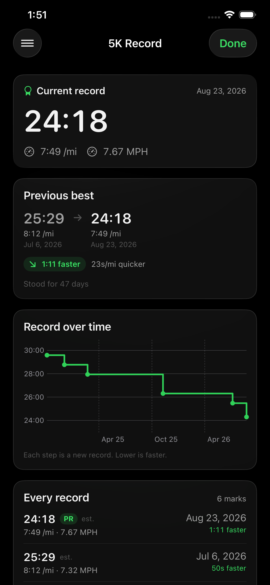
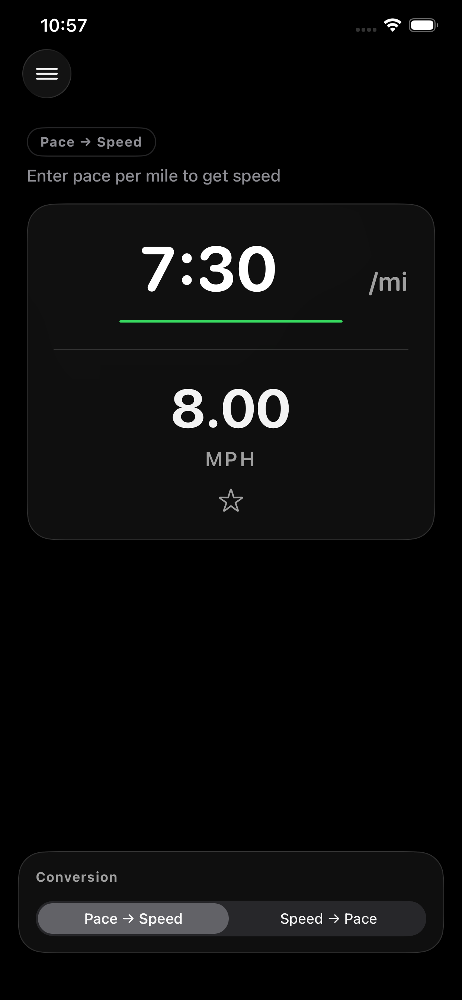

<div align="center">


# RunPace

**Convert running pace ⇄ speed, instantly.**

A native iOS app built with SwiftUI for runners — convert pace to MPH/KPH, browse a reference table, and track your runs and trends from Apple Health.

[](https://apps.apple.com/us/app/runpace-speed-converter/id6759844858)


</div>

## Screenshots

<table align="center">
  <tr>
    <td align="center" width="20%"><br /><sub><b>Pace ⇄ speed</b></sub></td>
    <td align="center" width="20%"><br /><sub><b>Run history · HR · PRs</b></sub></td>
    <td align="center" width="20%"><br /><sub><b>Speed trends</b></sub></td>
    <td align="center" width="20%"><br /><sub><b>PR progression</b></sub></td>
    <td align="center" width="20%"><br /><sub><b>Dark mode</b></sub></td>
  </tr>
</table>

## Features

- **Two-way conversion** — pace (mm:ss per mile/km) ⇄ speed (MPH/KPH), updating in real time as you type
- **MPH & KM/H** — toggle units; the app remembers your last-used direction and unit
- **Reference table** — common pace/speed benchmarks for both units
- **Run history** — reads and locally caches your Apple Health running workouts; filter by week, month, year, or all time
- **Speed trends** — see your overall average-speed direction, then compare like-for-like efforts with 5K, 10K, and other named-distance breakdowns (within ±5% of each distance)
- **Heart rate** — average heart rate per run from Apple Health when available
- **Distance trend** — see whether your runs are getting longer, with every run plotted against a best-fit line
- **Personal records** — track your best efforts across common distances plus your longest run, and open each record to see what it beat and how it progressed over time
- **Customizable launch screen** — choose which RunPace tool opens when you launch the app
- **Polished by default** — full light/dark mode and subtle haptic feedback

## Requirements

- iOS 17+
- Xcode 16+

## Getting Started

```sh
git clone https://github.com/saadjs/runpace.git
cd runpace
open pace-to-mph.xcodeproj
```

Then build and run on a simulator or device (⌘R).

## License

All rights reserved. © Saad
